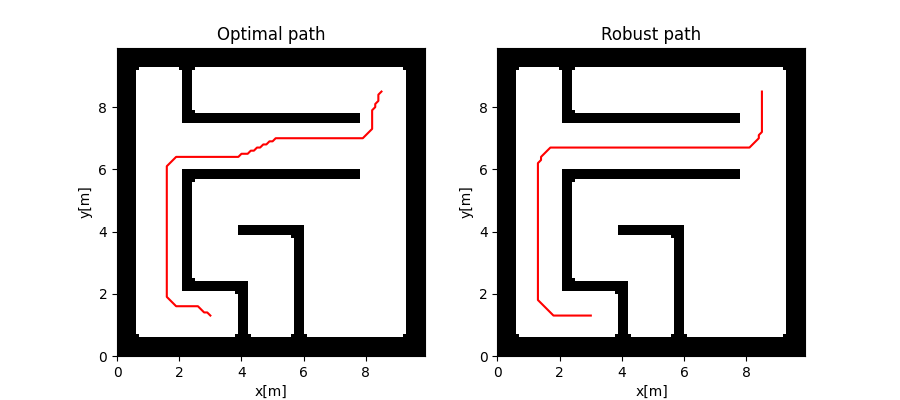

# Hexapod Explorer

Dmitry Lekhovitsky (<lekhodmy@fel.cvut.cz>, <lekhovitsky@gmail.com>)

## Overview

This is a final project for [Artificial Intelligence in Robotics course](https://cw.fel.cvut.cz/wiki/courses/b4m36uir/start) at Czech Technical University in Prague. The main goal is to implement a walking hexapod robot that should explore and build the map of an unknown environment. The implementation mostly follows the suggested [guidelines](https://cw.fel.cvut.cz/wiki/courses/b4m36uir/projects/start) with small modifications in code structure, signatures and approaches. 

To run the project, open the scene `assets/scene2_blocks.ttt` (or any other correctly configured scene) in CoppeliaSim, and execute `python3 run_explorer.py`. The robot should start the motion, and the updating map of the environment should appear in a separate window. When the exploration is finished, the full map of the environment and robot's executed trajectory are shown. For the mentioned scene, the output might look as follows:

Most of the logic is implemented in two packages: `controller` and `explorer`. The former contains a hexapod simulator, and a class `HexapodController` responsible for robot's motion (given a goal, make a twist it (_navigation_), and execute the movements (_locomotion_)). The latter contains three important classes for exploration process:

* `Mapper`: given a laser scan data, updates the probabilistic occupancy grid map;
* `Planner`: given an occupancy grid map, selects the next goals for exploration (frontier detection) and plans the path to them;
* `Explorer`: glues all three mentioned classes together, implementing the exploration pipeline.

Useful data structures are located in `messages` package, similarly to ROS messages.

The detailed description of individual components follows.

## Trajectory Following

The code for the locomotion part was provided in advance, so the only goal was to implement the navigation part, which produces a twist to steer the robot's motion towards a given goal.

Most of the logic is implemented in `HexapodController.make_twist` method. The twist has two components, _linear_ and _angular_. The rule for a linear component is to go full speed unless close enough to the goal (determined by the `SLOWDOWN_DISTANCE`). The angular component is given by the angle between the current and the desired directions, multiplied by a `TURNING_SPEED`. Finally, if the angular component is large enough, the linear one gets decreased. This allows the robot to make large turns staying in a single place, which is healthy for collision management. Both components are then clipped to the range `[-1; 1]` and used to steer the robot's legs.

Once the robot is close enough to the goal, defined by `DELTA_DISTANCE`, it stops, signaling that the goal is reached and the new one is needed.

**Note**: in the current implementation, the exploration stops if the robot collides with an obstacle. 

See `tests/test_walking.py` for an example.

## Mapping

The goal of a mapping component is to repeatedly update the probabilistic occupancy grid map by fusing the laser scan data. The latter is assumed to be a list of distances at which rays at the corresponding angle "hit" obstacles. The map is assumed to be of dynamic size, so extension logic is also needed.

The implementation is located at `Mapper.fuse_laser_scan` and follows the [described approach](https://cw.fel.cvut.cz/wiki/courses/b4m36uir/hw/t1c-map) with no special notes.

See `tests/test_mapping.py` for an example.

## Frontier Detection

The goal of the frontier detection component is to find next exploration goals in a given occupancy grid map. 

Frontiers are representatives of free-edge cells clusters. Free-edge are unexplored cells that have at least one free and one unexplored cell in the 8-neighborhood. Frontier detection implementation is located at `Planner.find_frontiers()` and generally follows the [suggested approach](https://cw.fel.cvut.cz/wiki/courses/b4m36uir/hw/t1e-expl) with minor modifications.

The next goal of the component is to evaluate the utility of the selected frontiers to pick the new goal. The naive approach would be to use the negative path length (i.e., go to the closest frontier). The more advanced way to do this is to evaluate the possible information gain at a given frontier. Roughly speaking, it has the following stages:

* Determine the path from the current location to the frontier;
* Deduce the robot orientation from the last two points of the path;
* Use a simple sensor model to tell which cells are observable from the frontier at that orientation;
* Sum the individual information gains at those cells.

See the respective section in the guidelines and `Planner.find_frontiers_inf_gain` for more detailed comments.

**Note**: the explorer uses the ratio of information gain and path length as utility function. 

**Note**: large number of frontiers can significantly slow down the planning, so the planner considers only those having at least `MIN_CELLS_PER_CENTROID` free-edge cells. Although this speeds-up the planning, in some scenarios this behavior is undesirable, and can be turned off by setting that constant to 0.

See `tests/test_frontiers.py` for an example.

## Path Planning

The goal of the path planning component is to find a path from the start to the goal in a given probabilistic occupancy grid map.

The path planning implementation is located at `Planner.plan_path`. The overall idea is very typical to this domain: 1) grow obstacles in a probabilistic map (which creates a binary maze), 2) plan the path using A*, 3) smooth the path. Some comments need to be made, though:

* The obstacles are grown by `OBSTACLE_GROWTH_FACTOR * robot_size` to compensate for imperfect motion;
* The resulting path finishes within the given distance from the goal (by default it's `ASTAR_TOLERANCE_FACTOR * robot_size`), which is enough for the system to work correctly; this distance must be greater than the obstacle growth radius;
* The explorer uses the robust planning, which steers the A* heuristic so that the resulting path was further away from obstacles than the optimal one; the comparison of the optimal and the robust path is shown in the image below:

The "robustness" of the path can be controlled by changing `OBSTACLE_PENALTY_FACTOR`. In the image, the value 5000 is used. The real system uses only 100, however.

**Note**: due to imperfect motion, the robot sometimes might enter the areas considered to be grown obstacles. In this case, the last "valid" pose is used as a starting point of the plan.

**Note**: even in a static environment, as the robot moves and makes observations, the planned path might become invalid (e.g., some unexplored cell turns out to be an obstacle, gets "grown" and invalidates the path segment). Thus, some path validity tracking is needed. If the path becomes invalid, the explorer tries to build the new path to the same goal.

See `tests/test_planning.py` for an example.