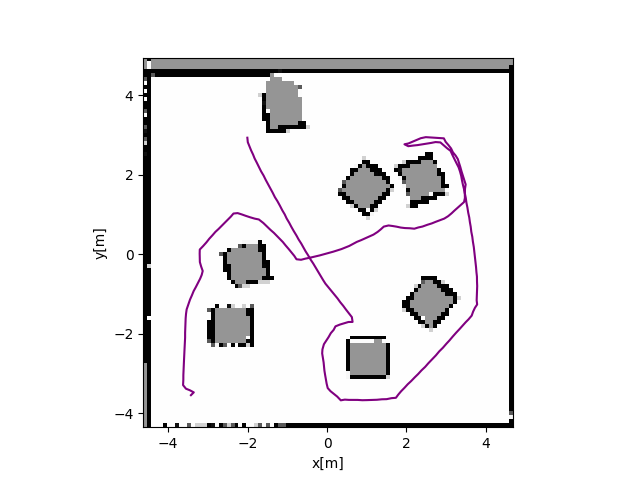

# Hexapod Explorer

Dmitry Lekhovitsky (<lekhodmy@fel.cvut.cz>, <lekhovitsky@gmail.com>)

## Overview

This is a final project for [Artificial Intelligence in Robotics course](https://cw.fel.cvut.cz/wiki/courses/b4m36uir/start) at Czech Technical University in Prague. The main goal is to implement a walking hexapod robot that should explore and build the map of an unknown environment. The implementation mostly follows the suggested [guidelines](https://cw.fel.cvut.cz/wiki/courses/b4m36uir/projects/start) with small modifications in code structure, signatures and approaches. 

To run the project, open the scene `assets/scene2_blocks.ttt` (or any other correctly configured scene) in CoppeliaSim, and execute `python3 run_explorer.py`. The robot should start the motion, and the updating map of the environment should appear in a separate window. When the exploration is finished, the full map of the environment and robot's executed trajectory are shown. For the mentioned scene, the output might look as follows:

Most of the logic is implemented in two packages: `controller` and `explorer`. The former contains a hexapod simulator, and a class `HexapodController` responsible for robot's motion (given a goal, make a twist it (_navigation_), and execute the movements (_locomotion_)). The latter contains three important classes for exploration process:

* `Mapper`: given a laser scan data, updates the probabilistic occupancy grid map;
* `Planner`: given an occupancy grid map, selects the next goals for exploration (frontier detection) and plans the path to them;
* `Explorer`: glues all three mentioned classes together, implementing the exploration pipeline.

Useful data structures are stored in `messages` package, similarly to ROS messages.

The detailed description of individual components follows.

## Trajectory Following

The code for the locomotion part was provided in advance, so the only goal was to implement the navigation part, which produces a twist to steer the robot's motion towards a given goal.

Most of the logic is implemented in `HexapodController.make_twist` method. The twist has two components, _linear_ and _angular_. The rule for a linear component is to go full speed unless close enough to the goal (determined by the `SLOWDOWN_DISTANCE`). The angular component is given by the angle between the current and the desired directions, multiplied by a `TURNING_SPEED`. Finally, if the angular component is large enough, the linear one gets decreased. This allows the robot to make large turns staying in a single place, which is healthy for collision management. Both components are then clipped to the range `[-1; 1]` and used to steer the robot's legs.

Once the robot is close enough to the goal, defined by `DELTA_DISTANCE`, it stops, signaling that the goal is reached and the new one is needed.

See `tests/test_walking.py` for an example.

## Mapping

See `tests/test_mapping.py` for an example.

## Frontier Detection

See `tests/test_frontiers.py` for an example.

## Path Planning

See `tests/test_planning.py` for an example.